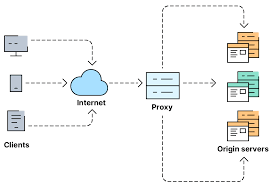
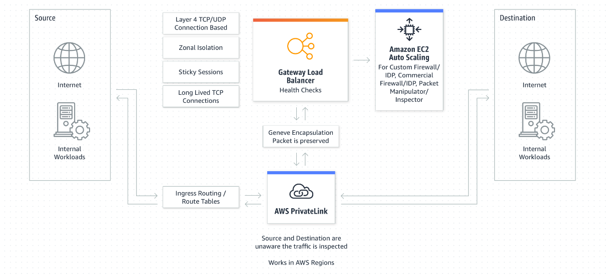
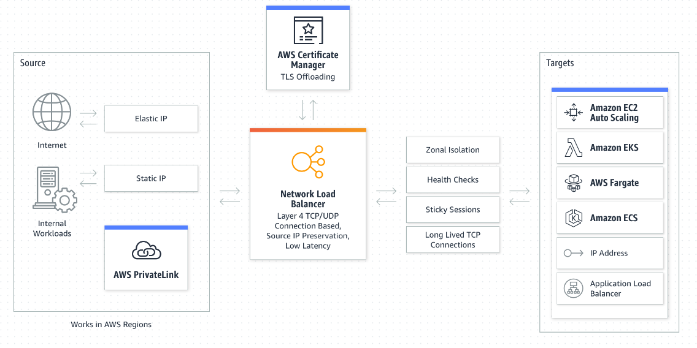
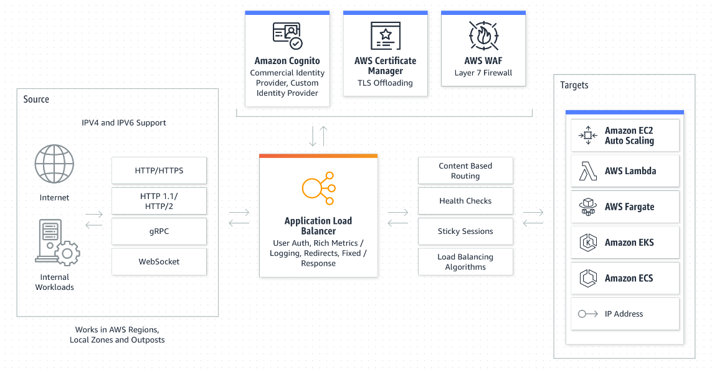
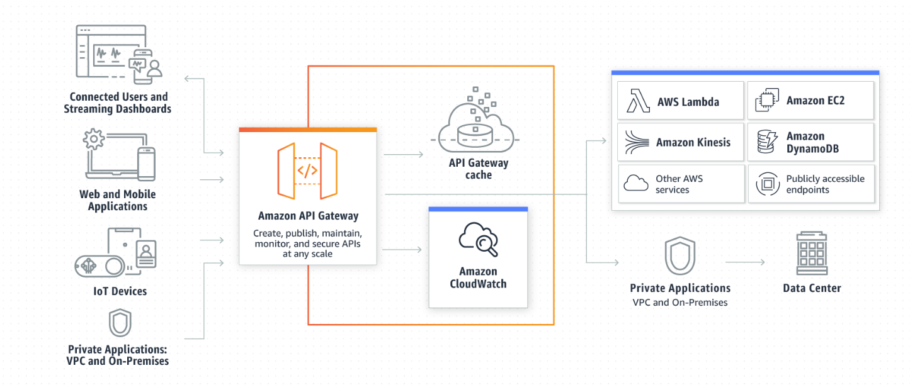

# Aws_web_application_load_balancer_vs_API-gateway

## Load Balancer

#### What is Load Balancer?
* Load balancing is the method of distributing network traffic equally across a pool of resources that support an application.

    

### AWS Load Balancer:
* Elastic Load Balancing (ELB) automatically distributes incoming application traffic across multiple targets and virtual appliances in one or more Availability Zones (AZs).

* **ELB offers three types of load balancers:**
    * Classic Load Balancer (CLB):
        * It operates at both the request level and the connection level. Classic Load Balancers are suitable for applications that were built within the EC2-Classic network.
        
    * Network Load Balancer (NLB):
        * Designed to handle TCP, UDP, and TLS traffic efficiently. NLB operates at the transport layer (Layer 4) of the OSI model, making it suitable for high-performance, low-latency scenarios.
        
    * Application Load Balancer (ALB):
        * Ideal for applications that run on HTTP and HTTPS. ALB operates at the application layer (Layer 7) of the OSI model, allowing advanced routing capabilities and supporting features such as content-based routing, host-based routing, and path-based routing.
        

* **Amazon API Gateway**
    * Amazon API Gateway is a fully managed service that makes it easy for developers to create, publish, maintain, monitor, and secure APIs at any scale. APIs act as the "front door" for applications to access data, business logic, or functionality from your backend services.

    * API Gateway provides types of API types:
        * HTTP API
        * WebSocket API
        * REST API
        * REST API Private

## Difference b/w AWS Application Load Balancer vs AWS API Gateway

| AWS Application Load Balancer | AWS API Gateway |
| --- | --- |
| Layer 7 load balancer, which automatically distributes incoming traffic to backend targets. | Serverless API service from AWS. It acts as an entry-point for your application and site between applications and backend services. |
| ALB support Web Application Firewall(WAF)protection out of the box | API gateway support Web Application Firewall(WAF)protection out of the box |
| ALB doesn’t cache responses | You can cache(need to pay extra $$🤑)(Cache size: 500MB — 237GB)(Timeout: 0–3600sec)the responses for a specific methods |
| ALB doesn’t provide any rate limiting(but throttling can be implemented via WAF) or bursting capability. | You can implement rate limiting(soft limit 10,000 requests per second)and bursting for API i.e. how often a user can call specific API |
| Possible to get a static IP for loadbalancer endpoint using AWS Global accelerator. | Not possible to get a static IP for the url endpoint. |
| Accept both HTTP and HTTPS(SSL configuration required)traffic. | Only accepts HTTPS traffic. |
| Can’t perform request validation, request/response mapping | Can perform request validation(use apache velocity template), request/response mapping |
| ALB can handle spiky traffic, but there is a delay, but that can be overcome by pre-allocating LoadBalancer Capacity Unit(LCU), but that will incur extra cost. | Handle spiky traffic(default rate = 10k RPS, 5k burst rate). |
| ALB is a regional service and can only integrate with Lambda in the same region | API can integrate with Lambda in different regions and in different AWS accounts. |
| You can’t import/export ALB rules in cross-platform | You can export/import API cross API platforms using tools like Open API 3.0 (formally known as swagger) |
| ALB supports two Load Balancing strategy Round Robin or the least strategy | API gateway only supports Round Robin load balancing |
| Timeout limit is 4000 seconds | Timeout limit is 29 seconds |
| You can define health checks in ALB to monitor the state of running resources in your target group. | No health check available(you need to write your own custom health check) |